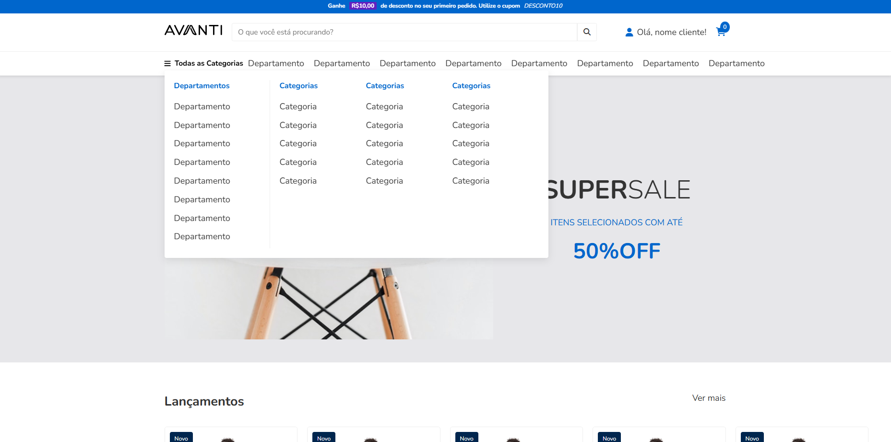

# Layout Avanti

Este projeto é um desafio de landing page com foco em interatividade e responsividade. A página permite que os usuários busquem por produtos usando um campo de entrada (input) de busca.

## Screenshot



## Tecnologias Utilizadas

- **HTML5**: Estrutura da página.
- **CSS3**: Estilização e responsividade.
- **JavaScript**: Funcionalidade interativa, incluindo controle de carrosséis e pesquisa.
- **Swiper**: Biblioteca de carrossel para exibição de produtos.

### Clonando o repositório

```bash
git clone https://github.com/gaabs16/challenges-innovation.git